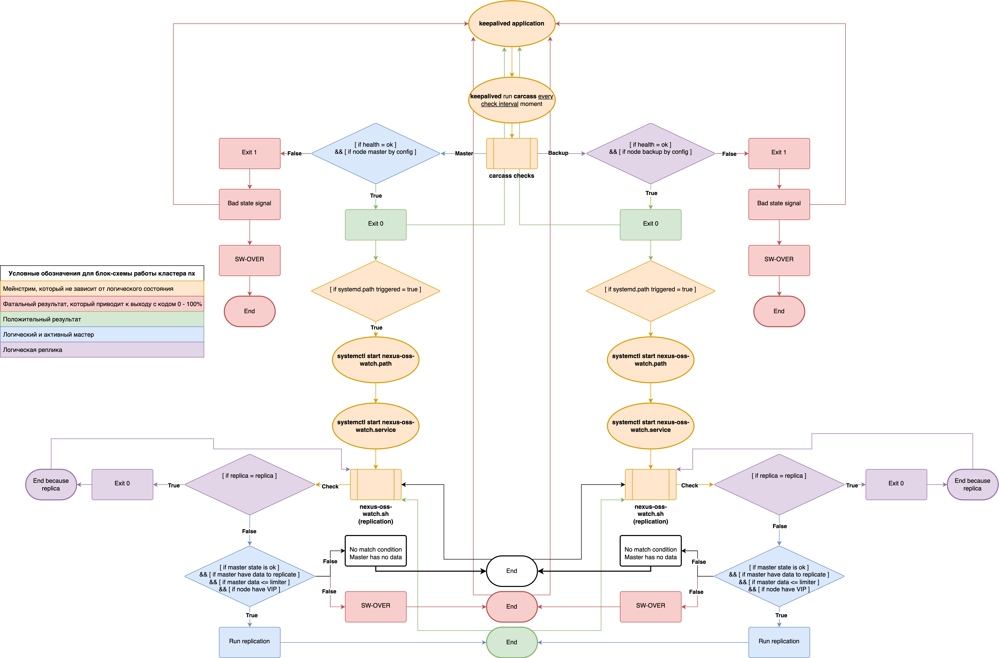
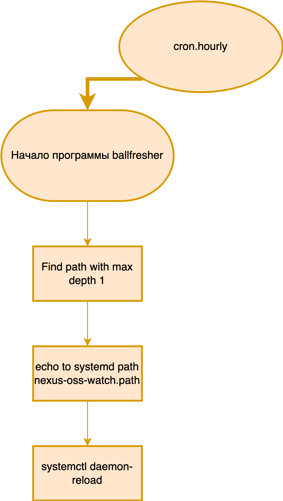
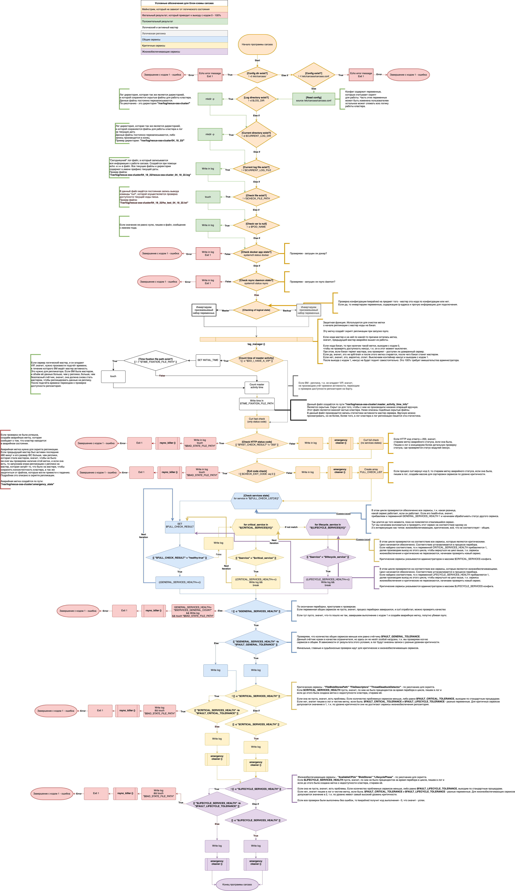

# carcass

This repository contains code of open-source solution was written for a Nexus-OSS repository free-version clusterization purpose. This project is published as an example. To prepare it for work you would need to refactor it because it was developed as a quite specific solution.

## Failover cluster nexus-oss with data replication

### Table of contents

* [General information](#general-information)
* [How the cluster works](#how-the-cluster-works)
* [Cluster and replication flowcharts](#cluster-and-replication-flowcharts)
* [Installing the nx cluster](#installing-the-nx-cluster)
* [Full logic of the carcass package](#full-logic-of-the-carcass-package)

## General information

A typical nexus cluster consists of 2 nodes. To avoid split-brain, a trusted server is used, thanks to which the availability of a neighboring node is checked. The cluster is based on software:

1. **keepalived** (Application that allows you to implement simple network logic for working with VIP with GARP support)
2. **carcass** (bash script, which is executed by keepalived to control the cluster, implements extended cluster logic)
3. **systemd path/service** (System units that implement the trigger and launch the replication logic from the nexus-oss-watch.sh script)
4. **nexus-oss-watch.sh** (bash script that is executed whenever the systemd service runs it when processing a trigger from systemd
path)
5. **ballfresher** (bash script that is run by cron 1 time per hour. Its task is to update the paths monitored by systemd
path unit)
6. **rsync** (run by the nexus-oss-watch.sh script with the necessary parameters to create an exact replica)
7. **docker**
8. **docker-compose**
9. **nexus-oss**

A cluster of repositories is built on the database of components.

## How the cluster works

The most detailed description of the logic can be obtained from the block diagram below. 

1. **The cluster logic** framework is built on keepalived and carcass, part of the logic is performed by nexus-oss-watch.sh. Let's start with keepalived:
Keepalived is configured in such a way that the Master is defined in the configuration file on the 1st node, it also has a higher priority than Backup, so Backup will become the active master only if the Master exits for some reason . For this reason, several definitions are used here. Logical Master - the master defined in the configuration file | Backup is a logical replica. | The active master is the node that owns the VIP and handles the cluster load.
Keepalived provides the basic functionality for a simple and lightweight VIP processing logic, with support for all necessary protocols.
Extends the keepalived logic from the carcass script, which implements additional logic and components missing in keepalived.

2. **carcass** - a script that is an extension of keepalived's capabilities in terms of checking the availability of services and managing a cluster, which implements sw-over mechanisms, which simply cannot be managed through keepalived.

3. **nexus-oss-watch.sh** - script that runs when a trigger occurs from nexus-oss-watch.path. From this trigger, nexus-oss-watch.service is launched, which in due time starts nexus-oss-watch.path, which controls replication.
The trigger from nexus-oss-watch.path comes when a write event occurs on one of the paths. A sufficient condition for the occurrence of a trigger is the fact of recording itself. Thus, the trigger occurs before ".close" occurs. This script also has the ability to control part of the cluster logic.

## Cluster and replication flowcharts

## Installing the nx cluster

1. **VM parameters** for openstack, which are necessary for role rollout:
    * astra-linux 
    * flavor parameters: (x16384 MiB - RAM + 8 vCPUs) + !< 100 GiB Boot disk + !< (necessary storage space for you) Tb /var/ (available in cloud) 
    * !< 1 network interface + 1 free VIP addr
2. **Download** the project in git.
3. **Change** to the ansible environment directory.
4. **Change** the ip addresses of the nodes in group_vars && host_vars + inventory. If you need to change the value of the cluster operation parameters other than those set by default, do it in group_vars + host_vars. Some parameters need to be changed in the nexus_ha/templates/carcass role. conf.j2
5. **After that**, it will be possible to start launching the playbook. Produced by the command:
`ansible-playbook -i inventories/hosts nexus-oss_prepare.yml -b`

## Full logic of the carcass package

---

---

